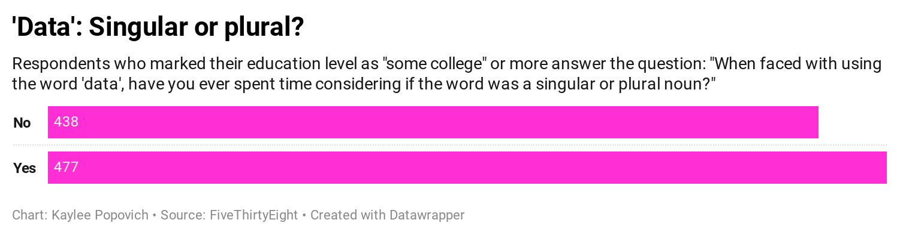

# Final project for Kaylee Popovich

### What's better than data, grammar, and arguing?

There are a lot of incredibly important and groundbreaking datasets in the ether of the Internet that expose injustices, reveal patterns and aid researchers. This isn't one of them.

As I perused datasets on FiveThirtyEight, my eyes glazed over at the innumerable surveys about sports, politics, and more sports. And then I saw it-[Elitist, Superfluous, or Popular? We Polled Americans on the Oxford Comma](https://fivethirtyeight.com/features/elitist-superfluous-or-popular-we-polled-americans-on-the-oxford-comma/). With my inner grammar snob's interest peaked, I clicked the article, scrolled through the page and clicked "Get the Data on Github".

The debate surrounding the use of the Oxford comma is both meaningless and continuous, making it the perfect indefinite-quarantine-period-due-to-COVID-19-pandemic activity. But what is the definition of the Oxford comma? [Dictionary.com](https://www.dictionary.com/browse/oxford-comma) defines it as, "a comma between the final items in a list, often preceding the word 'and' or 'or', such as the final comma in the list *newspapers, magazines, and books*". 

