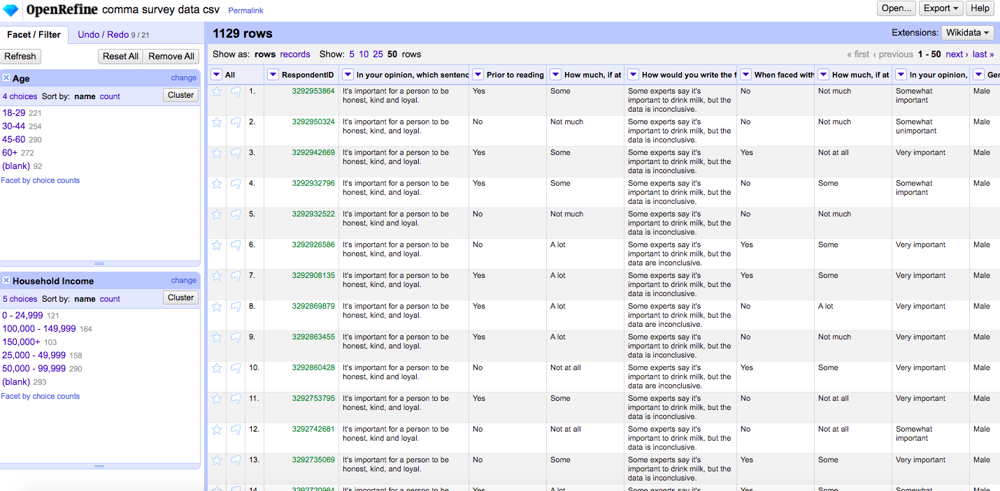
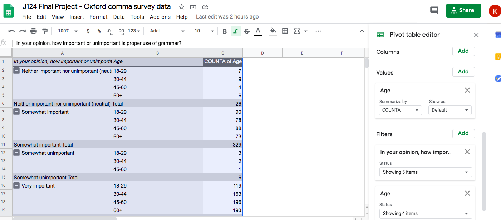

# Final project for Kaylee Popovich

## What's better than data, grammar, and arguing?

##### There are a lot of incredibly important and groundbreaking datasets in the ether of the Internet that expose injustices, reveal patterns and aid researchers. This isn't one of them.

As I perused datasets on FiveThirtyEight, my eyes glazed over at the innumerable surveys about sports, politics, and more sports. And then I saw it-[Elitist, Superfluous, or Popular? We Polled Americans on the Oxford Comma](https://fivethirtyeight.com/features/elitist-superfluous-or-popular-we-polled-americans-on-the-oxford-comma/). With my inner grammar snob's interest peaked, I clicked the article, scrolled through the page and clicked "Get the Data on Github".

The debate surrounding the use of the Oxford comma is both meaningless and continuous, making it the perfect indefinite-quarantine-period-due-to-COVID-19-pandemic activity. But exactly what is the Oxford comma? [Dictionary.com](https://www.dictionary.com/browse/oxford-comma) defines it as, "a comma between the final items in a list, often preceding the word 'and' or 'or', such as the final comma in the list *newspapers, magazines, and books*". It's a stylistic choice to use the comma in one's writing. For example, the Associated Press (AP) [Style Guide](https://owl.purdue.edu/owl/subject_specific_writing/journalism_and_journalistic_writing/ap_style.html) says to not use the comma in journalistic writing, but [Merriam-Webster](https://www.merriam-webster.com/dictionary/serial%20comma) acknowledges either way as legitimate. Its existence is seemingly innocuous. However, humans were left alone for too long, and anything can become a debate if we try hard enough.

FiveThirtyEight's analysis of the survey respondents' answers showed that in general, the people are split on their opinions about the Oxford comma. The match is pretty much a draw: 57 percent are pro-comma and 43 percent are con-comma. The survey also asked people if they think the word 'data' is singular or plural, and this verdict was more definitive: 79 percent stand by "the data is..." versus the 21 percent who said "the data are...".

However, there was more to this questionnaire than the FiveThirtyEight article covered. My project looks deeper into the Oxford comma and 'data' debate to see if there are any relationships between the demographic data for which the survey asked (edcuational background, household income, age, gender, location) and people's answers to the pressing matter of if they put an extra tick mark on their page when writing a list of three things or more.

The FiveThirtyEight .csv of the survey was already pretty clean, but I still worked with it a bit in OpenRefine to make it more suitable for my purposes. Below this paragraph is a screenshot from in the middle of my OpenRefine journey. The "greater than 60" age range on the survey was written as '>60', which made it diffult to sort the data in ascending numeric order because the sorting function would put the '>' terms first. I mass edited the column so it instead read '60+', so even though a symbol was still in the number, it would be properly sorted as the oldest age. I also removed the '$' from the household income column, though I did not end up working with this column as much. Additionally, I assigned number values to some of the questions that had answers on a sliding scale, so that I could make chloropleth maps in Datawrapper. For example, for the question, "How much, if at all, do you care about the use (or lack thereof) of the serial (or Oxford) comma in grammar?", I said that 1="not at all", 2="not much", 3="some", and 4="a lot". When summed and imported into Datawrapper, these values made creating a chloropleth map simpler so that I could show which areas of the country felt passionately about the comma and which were apathetic and probably asking themselves why they agreed to the survey in the first place.

When I began interrogating my data in a pivot table in Google Sheets, the first question I asked was, "Are people who have heard about the Oxford comma more likely to care about its use?" Out of the 655 people who had previously heard of the comma, 472 said they care "some" or "a lot" about its use, whereas the other 183 answered "not much" or "not at all". 444 people had not heard of the comma, but 233 of these respondents said they care "some" or "a lot" about it, despite previously answering that they had not heard of the comma. Perhaps having strong opinions on subjects about which one has little knowledge is the true American way.

The map below is a visualization of the data described above.

<iframe title="How Much People Care about the Oxford Comma in the United States" aria-label="map" id="datawrapper-chart-oc7kr" src="https://datawrapper.dwcdn.net/oc7kr/2/" scrolling="no" frameborder="0" style="width: 0; min-width: 100% !important; border: none;" height="557"></iframe>

Next, I turned my attention to 'data'. I wanted to know if people with some college education or more have, when faced with using the word 'data', considered if the noun is singular or plural. First, I tried different combinations of rows, values and filters in the pivot table. Initially I tried to look at the data individually, i.e., recording the number of respondents with graduate degrees who answered yes or no, the number of respondents with undergraduate degrees who answered yes or no, and so on. I decided this was too convoluted and probably not conducive to a wide readership, and instead made the "yes" and "no" answers rows in the pivot table and filtered the values so that only people with some college education or more were part of the data for the chart. The result was the following:

<iframe title="'Data': Singular or plural?" aria-label="Bar Chart" id="datawrapper-chart-3tezj" src="https://datawrapper.dwcdn.net/3tezj/1/" scrolling="no" frameborder="0" style="width: 0; min-width: 100% !important; border: none;" height="194"></iframe>

Though nearly 80 percent of all respondents said 'data' is a singular noun as stated earlier in the project, half of college-educated respondents said they had at least considered if it was singular or plural.

Lastly, I asked my data a general question: "Do perceptions about the importance of proper grammar differ by age group of respondents?" There were five different possible answers to the survey's question, "In your opinion, how important or unimportant is proper use of grammar?" and four different age groups to which the respondents fell. The pivot table that resulted looked pretty confusing at first:

I decided the best way to represent the data was a color-coded bar chart. The result was the following:

<iframe title="Importance of Good Grammar to People of Different Ages" aria-label="Bar Chart" id="datawrapper-chart-CS12F" src="https://datawrapper.dwcdn.net/CS12F/1/" scrolling="no" frameborder="0" style="width: 0; min-width: 100% !important; border: none;" height="868"></iframe> 

1,000 out of the 1,130 people who took the survey said that good grammar is either "very important" or "somewhat important", with 671 responding with "very important" and 329 saying "somewhat important". For those who answered "very important", 196 were between 45 and 60 years of age, 193 were older than 60, 163 were between 30 and 44 and 119 were between 18 and 29. It looks like the Boomers and the Gen-Xers beat the Millennials and the Gen-Zers at the grammar game.

All in all, people in the Pacific Census division care most about the usage of the Oxford comma, half of college-educated respondents at one time or another wondered if 'data' is a singular or plural noun, and people above the age of 45 think proper grammar is important in life. Why a debate has ensued over an optional punctuation mark is not something I can answer, but I'll part with the following challenge: Can you tell which side I'm on based on how I order my own lists in the text of this project?
